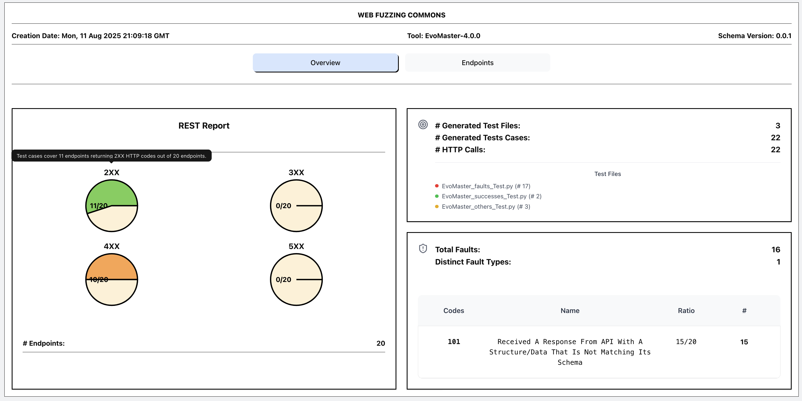
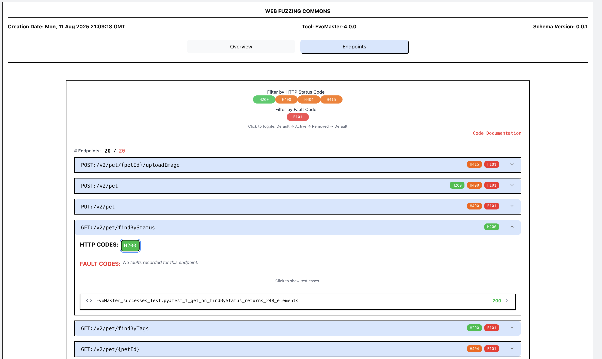

# EvoMaster: A Tool For Automatically Generating System-Level Test Cases


[](https://central.sonatype.com/artifact/org.evomaster/evomaster-client-java)
[](https://javadoc.io/doc/org.evomaster/evomaster-client-java-controller)

[](https://codecov.io/gh/WebFuzzing/EvoMaster)
[](https://zenodo.org/badge/latestdoi/92385933)
[](https://www.gnu.org/licenses/lgpl-3.0)
[](https://github.com/WebFuzzing/EvoMaster/releases)


### Summary

_EvoMaster_ ([www.evomaster.org](http://evomaster.org)) is the first (2016) open-source AI-driven tool
that automatically *generates* system-level test cases
for web/enterprise applications.
This is related to [Fuzzing](https://en.wikipedia.org/wiki/Fuzzing).
In particular, _EvoMaster_ can fuzz APIs such as REST, GraphQL and RPC.
Not only _EvoMaster_ can generate inputs that find program crashes, but also it generates small effective test suites (e.g., in Python, JavaScript and Java/Kotlin JUnit format) that can be used for _regression testing_.

_EvoMaster_ is an AI driven tool.
In particular, internally it uses an [Evolutionary Algorithm](https://en.wikipedia.org/wiki/Evolutionary_algorithm)
and [Dynamic Program Analysis](https://en.wikipedia.org/wiki/Dynamic_program_analysis)  to be
able to generate effective test cases.
The approach is to *evolve* test cases from an initial population of
random ones, trying to maximize measures like code coverage and fault detection.
_EvoMaster_ uses several kinds of AI heuristics to improve performance even further,
building on decades of research in the field of [Search-Based Software Testing](https://en.wikipedia.org/wiki/Search-based_software_engineering).


### 1-Minute Example 

On a console, copy&paste the following (requires _Docker_ installed).
It will fuzz the PetClinic example API from Swagger, for 30 seconds, as shown in the following video. 

```
docker run -v "$(pwd)/generated_tests":/generated_tests webfuzzing/evomaster  --blackBox true --maxTime 30s  --ratePerMinute 60 --bbSwaggerUrl  https://petstore.swagger.io/v2/swagger.json
```


#### Using Docker on Different Shells

Note that, depending on which shell and operating system you are using, you might need slightly different commands when mounting folders with the `-v` option.  

For example, if run in a MSYS shell on Windows like _Git Bash_, there is the need of an extra / before the $.

```
docker run -v "/$(pwd)/generated_tests":/generated_tests webfuzzing/evomaster  --blackBox true --maxTime 30s  --ratePerMinute 60 --bbSwaggerUrl  https://petstore.swagger.io/v2/swagger.json
```

If you are rather using a Command Prompt (Cmd.exe) terminal, you need to use `%CD%` instead of `$(pwd)` to refer to the current folder:

```
docker run -v %CD%/generated_tests:/generated_tests webfuzzing/evomaster  --blackBox true --maxTime 30s  --ratePerMinute 60 --bbSwaggerUrl  https://petstore.swagger.io/v2/swagger.json
```

On the other hand, on a PowerShell you need `${PWD}`:

```
docker run -v ${PWD}/generated_tests:/generated_tests webfuzzing/evomaster  --blackBox true --maxTime 30s  --ratePerMinute 60 --bbSwaggerUrl  https://petstore.swagger.io/v2/swagger.json
```

#### Troubleshooting

If you encounter issues running the command:

* Ensure Docker is installed and running.
* Check that you have the correct rights/permissions to mount the specified volume.
* Consult the Docker documentation for your shell environment for specific syntax requirements.


#### Generated Output

Once the command is executed, you can inspect the generated files under `generated_tests` folder. 

Note, since version 4.0.0, now _EvoMaster_ by default also creates an interactive web report.





### Key features

* _Web APIs_: At the moment, _EvoMaster_ can generate test cases for __REST__, __GraphQL__ and __RPC__ (e.g., __gRPC__ and __Thrift__) APIs.

* _Free_: this is an open-source project, with funding from public research (e.g., professors, postdocs and PhD students).
          There is no monetary cost involved in using this tool, or need to use any paid external services (e.g., external LLM APIs).
          If you are a resident in EU, Norway, Argentina, China, or any associate country involved with ERC, thanks for your tax money supporting this project. 

* _In-house, no telemetry_: currently there is no telemetry in use in _EvoMaster_, and it does not require to connect to any external service on internet, besides the tested application. AFAIK, it can be run in-house without any worry of leaking any IP to external parties (if not, please open a new issue to tell us how that could happen, and we will try to fix it). 

* _Black-Box_ testing mode: can run on any API (regardless of its programming language, e.g., Python and Go).
  However, results for black-box testing will be worse than white-box testing (e.g., due to lack of code analysis).
  Default test case output is in Python, but other formats are available as well. 

* _White-Box_ testing mode: can be used for APIs compiled to
  JVM (e.g., Java and Kotlin). _EvoMaster_ analyses the bytecode of the tested applications, and uses
  several heuristics such as _testability transformations_ and _taint analysis_ to be able to generate
  more effective test cases. We support JDK __8__ and the major LTS versions after that (currently JDK __21__). Might work on other JVM versions, but we provide __NO__ support for it.
  Note: there was initial support for other languages as well, like for example JavaScript/TypeScript and C#, but they were not in a stable, feature-complete state. The support for those languages for white-box testing has been dropped, at least for the time being. 

* _Installation_: we provide installers for the main operating systems: _Windows_ (`.msi`),
  _OSX_ (`.dmg`) and _Linux_ (`.deb`). We also provide an uber-fat JAR file.
  To download them, see the [Release page](https://github.com/WebFuzzing/EvoMaster/releases).
  Release notes are present in the file [release_notes.md](https://github.com/WebFuzzing/EvoMaster/blob/master/release_notes.md).
  If you are using the uber-fat JAR, it should work with any major LTS version (from JDK 8 on).
   Whereas for the client library, needed for white-box testing, we will support JDK 8 likely for a long, long while, be warned that future versions of the executable JAR might start to require higher versions of the JDK in a non-so-distant future.
   If that is going to be higher than your current version of the JVM, if you cannot upgrade or have 2 different JDKs on your machine, then you should not use the uber-jar but rather one of the installers. 
   When you use one of the installers, keep in mind that currently they do not update the `PATH` variable. This needs to be done manually, [see documentation](docs/download.md). 
   Also keep in mind we have not paid the [Microsoft/Apple Tax](docs/download.md). This means that your operating system by default will block the installation, stating it cannot verify it is not a malware. 
   But the block [can be bypassed](docs/download.md).

* _Docker_: _EvoMaster_ is now released via Docker as well, under [webfuzzing/evomaster](https://hub.docker.com/r/webfuzzing/evomaster) on Docker Hub. For more information on how to use _EvoMaster_ via Docker, [see documentation](docs/docker.md).

* _GitHub Action_: it is possible to run _EvoMaster_ in GitHub Actions, as part of Continuous Integration, by using the [following custom action](https://github.com/WebFuzzing/evomaster-action) (which is in a different GitHub repository).

* _Hardware_: although state-of-the-art AI techniques are used, there is no major hardware requirement to be able to run _EvoMaster_. It will work even on old laptops. The main computational bottleneck is running the tested applications, and making network calls to them. 

* _State-of-the-art_: an [independent study (2022)](https://arxiv.org/abs/2204.08348), comparing 10 fuzzers on 20 RESTful APIs, shows that _EvoMaster_ gives the best results. Another [independent study (2024)](https://arxiv.org/abs/2410.12547) done by a different research group confirms these results.

* _Schema_: REST APIs must provide a schema in [OpenAPI/Swagger](https://swagger.io)
  format (either _v2_ or _v3_).

* _Output_: the tool generates _JUnit_ (version 4 or 5) tests, written in either Java or Kotlin, as well as test suites in Python and JavaScript. For a complete list, see the documentation for the CLI parameter [--outputFormat](docs/options.md). 
  Some examples are: PYTHON_UNITTEST, KOTLIN_JUNIT_5, JAVA_JUNIT_4 and JS_JEST.
  Note that the generated tests rely on third-party libraries (e.g., to make HTTP calls). 
  These will need to be setup in your projects, [see documentation](docs/library_dependencies.md).

* _Web Report_: besides generating executable tests in different programming language, an interactive _index.html_ web report is created as well by default, visualizing and summarizing the results of the generated tests. 

* _Fault detection_: _EvoMaster_ can generate tests cases that reveal faults/bugs in the tested applications.
  Different heuristics are employed, like checking for 500 status codes, mismatches from the API schemas and access policy violations.

* _Self-contained tests_: for white-box testing, the generated tests do start/stop the application, binding to an ephemeral port.
  This means that the generated tests can be used for _regression testing_ (e.g., added to the Git repository
  of the application, and run with any build tool such as Maven and Gradle).
  For black-box testing, you will need to make sure the application is up and running before executing the tests. 

* _Database handling_: for white-box testing, _EvoMaster_ can intercept and analyse all communications done with SQL and MongoDB databases, and use
  such information to generate higher code coverage test cases. Furthermore, it can generate data directly
  into the databases, and have such initialization automatically added in the generated tests.
  At the moment, _EvoMaster_ supports _Postgres_, _MySQL_, _H2_  and MongoDB  databases.

* _Authentication_: we support auth based on authentication headers and cookies.
  Besides using fixed HTTP headers, 
  it is also possible to declaratively specify which login endpoint should be used to dynamically obtain authentication info (e.g., auth tokens or cookies) for each test execution. [See documentation](docs/auth.md).

### Known Limitations

* _Driver_: to be used for _white-box_ testing, users need to write a [driver manually](docs/write_driver.md).
  We recommend to try _black-box_ mode first (should just need a few minutes to get it up and running) to get
  an idea of what _EvoMaster_ can do for you.

* _JDK 9+_: white-box testing requires bytecode manipulation. 
            Each new release of the JDK makes doing this harder and harder. 
            Dealing with JDKs above __8__ is doable, but it requires some settings.
            [See documentation](docs/jdks.md).

* _Execution time_: to get good results, you might need to run the search for several hours.
  We recommend to first try the search for 10 minutes, just to get an idea of what type of tests can be generated.
  But, then, you should run _EvoMaster_ for something like between 1 and 24 hours (the longer the better, but
  it is unlikely to get better results after 24 hours).

* _RPC APIs_: for the moment, we do not directly support RPC schema definitions. Fuzzing RPC APIs requires to write a driver, using the client library of the API to make the calls.

* _External services_: (e.g., other RESTful APIs) currently there is no support for them (e.g., to automatically mock them).
  It is work in progress.

* _Failing tests_: the tests generated by _EvoMaster_ should all pass, and not fail, even when they detect a fault.
  In those cases, comments/test-names would point out that a test is revealing a possible fault, while still passing.
  However, in some cases the generated tests might fail. This is due to the so called _flaky_ tests, e.g., when
  a test has assertions based on the time clock (e.g., dates and timestamps).
  There is ongoing effort to address this problem, but it is still not fully solved.

<!--### Videos---> 
<!-- 
<div>Icons made by <a href="https://www.flaticon.com/authors/freepik" title="Freepik">Freepik</a> from <a href="https://www.flaticon.com/" title="Flaticon">www.flaticon.com</a></div> 
-->


### Use in Industry

Several enterprises use _EvoMaster_ to fuzz their Web APIs.
We do few academia-industry collaborations ([see more info here](docs/contribute.md)), where we help test engineers to apply _EvoMaster_ on their systems, as long as we can then report on such experience.
Examples of Fortune 500 companies using _EvoMaster_ are:

* [Meituan](https://www.meituan.com): see [TOSEM'23](docs/publications/2023_tosem_rpc.pdf), [ASE'24](docs/publications/2024_ase.pdf), [SCP'25](docs/publications/2025_scp.pdf).

* [Volkswagen](https://www.volkswagen.com): see [AUSE'24](docs/publications/2024_ause_vw.pdf), [ICST'25](docs/publications/2025_icst.pdf).


### Videos


* A [45-minute talk given at TestCon'25](https://www.youtube.com/watch?v=uKKRo3LrNiw&list=PLqYhGsQ9iSEoXaRmW9WQjjXJK_1NbLlZ6&index=15) on Fuzz Testing Web APIs gives an overview of what can be expected from this kind of fuzzers.   

* A [short video](https://youtu.be/3mYxjgnhLEo) (5 minutes)
  shows the use of _EvoMaster_ on one of the
  case studies in [EMB](https://github.com/WebFuzzing/EMB).

* This [13-minute video](https://youtu.be/ORxZoYw7LnM)
  shows how to write a white-box driver for EvoMaster, for the
  [rest-api-example](https://github.com/WebFuzzing/rest-api-example).

* How to [Download and Install EvoMaster on Windows 10](https://youtu.be/uh_XzGxws9o), using its _.msi_ installer.

* [Short presentation](https://youtu.be/iQSAlrr-PZo) (5 minutes) about version 2.0.0. 

* [Demonstration of Docker and GitHub Actions support](https://youtu.be/l1ybs7SjvcA).

### Alternatives

In the last few years, several few tools have been proposed in the academic literature and in the open-source community.
You can read more details in this [2023 survey](docs/publications/2023_tosem_survey.pdf) on REST API testing.

Existing open-source tools for REST API fuzzing, with at least 100 stars on GitHub, are for example (in alphabetic order):
[CATS](https://github.com/Endava/cats),
[Dredd](https://github.com/apiaryio/dredd),
[Fuzz-lightyear](https://github.com/Yelp/fuzz-lightyear),
[ResTest](https://github.com/isa-group/RESTest),
[Restler](https://github.com/microsoft/restler-fuzzer),
and
[Schemathesis](https://github.com/schemathesis/schemathesis).

All these tools are _black-box_, i.e., they do not analyze the source-code of the tested APIs to generate more effective test data.
As we are the authors of EvoMaster, we are too biased to compare it properly with those other black-box tools.
However, different independent studies (e.g., in [2022](https://arxiv.org/abs/2204.08348) and [2024](https://arxiv.org/abs/2410.12547)) shows that EvoMaster is among the best performant.
Furthermore, if your APIs are running on the JVM (e.g., written in Java or Kotlin), then EvoMaster has clearly an advantage, as it supports _white-box_ testing. 

<!---
### Hiring

Depending on the year, we might have funding for _postdoc_ and _PhD student_ positions to work on this project (in Oslo, Norway).

Current open positions: none.
< !---
* 2023: PhD student positions. No new calls scheduled for the moment.
* 2023: Postdoc positions. No new calls scheduled for the moment.
--- >

For questions on these positions, please contact Prof. Andrea Arcuri.

< !---
For more details on current vacancies, see our group page at [AISE Lab](https://WebFuzzing.github.io/).
--->


### Documentation

If you are trying to use _EvoMaster_, but the instructions in this documentation are not enough to get you started, or they are too unclear, then it means it is a _bug_ in the documentation, which then would need to be clarified and updated. In such cases, please create a new [issue](https://github.com/WebFuzzing/EvoMaster/issues).

Also, feel free to start new discussion topics in the [Discussions forum](https://github.com/WebFuzzing/EvoMaster/discussions).
If you have time, please consider answering the polls there.

If you are working on an open-source API, you can drop us a message if you have problems using EvoMaster on it. 
Otherwise, if you are working in industry on closed-source APIs, we have options for academia-industry collaborations ([see more info here](docs/contribute.md)).  


* [Example of generated tests](docs/example.md)
* [Download and Install EvoMaster](docs/download.md)
* [Build EvoMaster from source](docs/build.md)
* [Command-Line Interface (CLI) options](docs/options.md)
* [OpenApi/Swagger Schema](docs/openapi.md)
* [Using EvoMaster for Black-Box Testing (easier to setup, but worse results)](docs/blackbox.md)
* [Using EvoMaster for White-Box Testing (harder to setup, but better results)](docs/whitebox.md)
  * [Write an EvoMaster Driver for White-Box Testing](docs/write_driver.md)
  * [Dealing with JDKs above version 8](docs/jdks.md)
* [Configuring authentication](docs/auth.md)  
* [Console output](docs/console_output.md)
* [Library dependencies for the generated tests](docs/library_dependencies.md)
* [How to contribute](docs/contribute.md)
  * [Technical notes for developers contributing to EvoMaster](docs/for_developers.md)
* Troubleshooting
  * [Windows and networking](docs/troubleshooting/windows.md)
  * [java.lang.OutOfMemoryError](docs/troubleshooting/outofmemory.md)
* More Info
  * [Academic papers related to EvoMaster](docs/publications.md)
  * [Slides of presentations/seminars](docs/presentations.md)
  * [Replicating studies](docs/replicating_studies.md)


### Funding

_EvoMaster_ has been funded by:
* 2020-2026: a 2 million Euro grant by the European Research Council (ERC),
  as part of the *ERC Consolidator* project
  <i>Using Evolutionary Algorithms to Understand and Secure Web/Enterprise Systems</i>.
*  2018-2021: a 7.8 million Norwegian Kroner grant  by the Research Council of Norway (RCN),
   as part of the Frinatek project <i>Evolutionary Enterprise Testing</i>.


This project has received funding from the European Research Council (ERC) under the European Union’s Horizon 2020 research and innovation programme (grant agreement No 864972).


### License
_EvoMaster_'s source code is released under the LGPL (v3) license.
For a list of the used third-party libraries, you can directly see the root [pom.xml](./pom.xml) file.
For a list of code directly imported (and then possibly modified/updated) from
other open-source projects, see [here](./docs/reused_code.md).


<!--
### 

YourKit supports open source projects with its full-featured Java Profiler.
YourKit, LLC is the creator of
<a href="https://www.yourkit.com/java/profiler/">YourKit Java Profiler</a>
and
<a href="https://www.yourkit.com/.net/profiler/">YourKit .NET Profiler</a>,
innovative and intelligent tools for profiling Java and .NET applications.
-->

