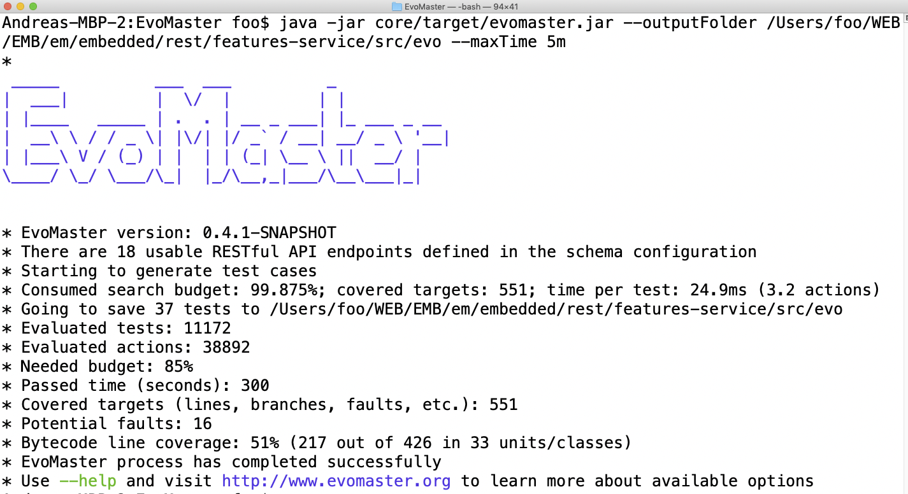

# Example




The following code is an example of one test that was automatically
generated by _EvoMaster_ for a REST service called 
"scout-api" (see [EMB repository](https://github.com/EMResearch/EMB)).
The generated test uses the [RestAssured](https://github.com/rest-assured/rest-assured) library.

```
@Test
public void test_36_with500() throws Exception {
        
   String location_media_files = "";
        
   String id_0 = given().accept("application/json")
                .header("Authorization", "ApiKey moderator") // moderator
                .contentType("application/json")
                .body(" { " + 
                    " \"uri\": \"hXf3e8B3ikGtuGjT\", " + 
                    " \"name\": \"nkeUfXVTC\", " + 
                    " \"copy_right\": \"\" " + 
                    " } ")
                .post(baseUrlOfSut + "/api/v1/media_files")
                .then()
                .statusCode(200)
                .assertThat()
                .contentType("application/json")
                .body("'uri'", containsString("hXf3e8B3ikGtuGjT"))
                .body("'name'", containsString("nkeUfXVTC"))
                .body("'copy_right'", containsString(""))
                .extract().body().path("id").toString();
                
   location_media_files = "/api/v1/media_files/" + id_0;
        
   given().accept("*/*")
                .header("Authorization", "ApiKey moderator") // moderator
                .get(resolveLocation(location_media_files, baseUrlOfSut + "/api/v1/media_files/1579038228/file"))
                .then()
                .statusCode(500) // se/devscout/scoutapi/resource/MediaFileResource_268_downloadFile
                .assertThat()
                .contentType("application/json")
                .body("'code'", numberMatches(500.0));
}
```

In this automatically generated test, a new resource is first created with a _POST_ command.
The _id_ of this newly generated resource is then extracted from the _POST_ response, and used in the URL
of a following _GET_ request on a sub-resource.
Such _GET_ request does break the backend, as it returns a __500__ HTTP status code.
The last line executed in the business logic of the backend is then printed as comment, to help debugging this fault.    


The generated tests are self-contained, i.e., they 
start/stop the REST server by themselves:

```
    private static SutHandler controller = new em.embedded.se.devscout.scoutapi.EmbeddedEvoMasterController();
    private static String baseUrlOfSut;
    
    
    @BeforeClass
    public static void initClass() {
        baseUrlOfSut = controller.startSut();
        assertNotNull(baseUrlOfSut);
        RestAssured.urlEncodingEnabled = false;
    }
    
    
    @AfterClass
    public static void tearDown() {
        controller.stopSut();
    }
    
    
    @Before
    public void initTest() {
        controller.resetStateOfSUT();
    }
```

The ability of starting/resetting/stopping the tested application is critical for using the generated 
tests in _Continuous Integration_ (e.g., Jenkins, Travis and CircleCI).
However, it requires to write a [_driver_](write_driver.md) to tell _EvoMaster_ how to do 
such start/reset/stop.
  

A generated test is not only going to be a sequence of HTTP calls toward a running application.
_EvoMaster_ can also set up the _environment_ of the application, like automatically adding all the
needed data into a SQL database.

