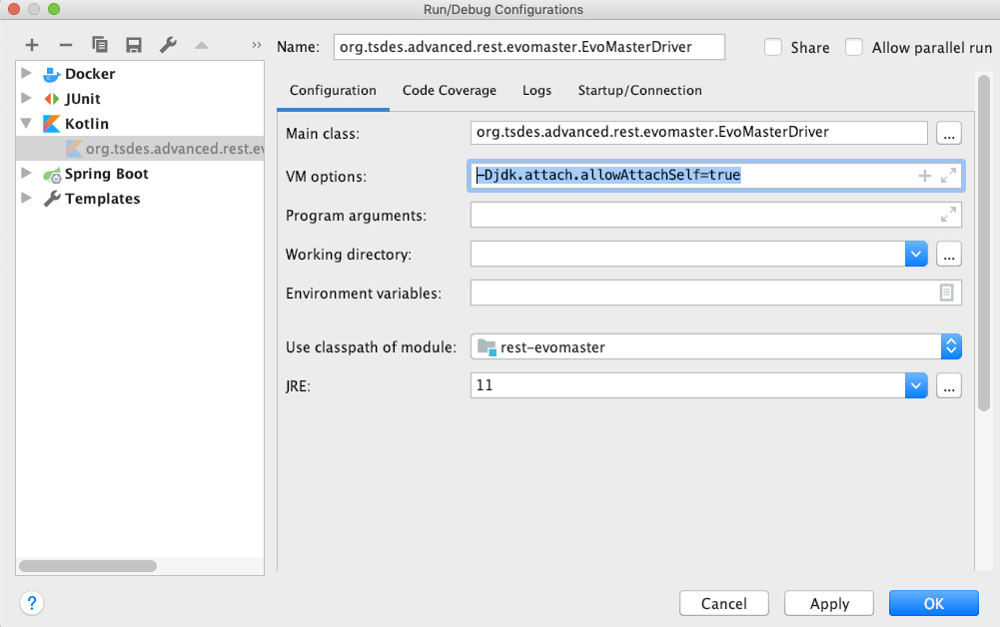

# EvoMaster Driver
    
To generate tests for [white-box testing](whitebox.md), you need an _EvoMaster Driver_ up and running before 
executing `evomaster.jar`.
These drivers have to be built manually for each system under test (SUT).
See the [EMB repository](https://github.com/EMResearch/EMB) for a set of existing SUTs with drivers.

To build a client driver in Java (or any JVM language), you need to import the
_EvoMaster_ Java client library. For example, in Maven:

```
<dependency>
   <groupId>org.evomaster</groupId>
   <artifactId>evomaster-client-java-controller</artifactId>
   <version>LATEST</version>
</dependency>
```

For the latest version, check [Maven Central Repository](https://mvnrepository.com/artifact/org.evomaster/evomaster-client-java-controller).
The latest version number should also appear at the top of the main readme page.
If you are compiling directly from the _EvoMaster_ source code, make sure to use `mvn install` to 
install the snapshot version of the Java client into your local Maven repository 
(e.g., under *~/.m2*). 

Once the client library is imported, you need to create a class that extends either
`org.evomaster.client.java.controller.EmbeddedSutController`
 or
 `org.evomaster.client.java.controller.ExternalSutController`.
Both these classes extend `SutController`.
The difference is on whether the SUT is started in the same JVM of the _EvoMaster_
driver (*embedded*), or in a separated JVM (*external*).
 
The easiest approach (which we recommend) is to use the *embedded* version, especially when dealing with
frameworks like Spring and DropWizard. 
However, when the presence of the _EvoMaster_ client library gives side-effects (although 
its third-party libraries are shaded, side-effects might still happen),
or when it is not possible (or too complicate) to start the SUT directly (e.g., JEE),
it is better to use the *external* version.
The requirement is that there should be a single, self-executable uber/fat jar for the SUT 
(e.g., Wildfly Swarm).
It can be possible to handle WAR files (e.g., by using Payara), 
but currently we have not tried it out yet.

Once a class is written that extends either `EmbeddedSutController` or
`ExternalSutController`, there are a few abstract methods that need to
be implemented.
For example, those methods specify how to start the SUT, how it should be stopped,
and how to reset its state.
The _EvoMaster_ Java client library also provides further utility classes to help
writing those controllers/drivers.
For example, `org.evomaster.client.java.controller.db.DbCleaner` helps in resetting
the state of a database (if any is used by the SUT).


Once a class `X` that is a descendant of `SutController` is written, you need
to be able to start the _EvoMaster_ driver, by using the 
`org.evomaster.client.java.controller.InstrumentedSutStarter`
class. 
For example, in the source code of the class `X`, you could add:
 
```
public static void main(String[] args){

   SutController controller = new X();
   InstrumentedSutStarter starter = new InstrumentedSutStarter(controller);

   starter.start();
}
```

At this point, once this driver is started (e.g., by right-clicking on it in
an IDE to run it as a Java process),
then you can use `evomaster.jar` to finally generate test cases.

__WARNING__: Java 9 broke backward compatibility. 
One painful change was that self-attachment of Java-Agents (needed for bytecode instrumentation)
is now forbidden by default.
When for example starting the driver with a JDK 9+ (e.g., JDK __11__), you need to add the VM option
`-Djdk.attach.allowAttachSelf=true`, otherwise the process will crash.   
For example, in IntelliJ IDEA:



Note: there is a hacky workaround for this "_feature_" 
(i.e., as done in [ByteBuddy](https://github.com/raphw/byte-buddy/issues/295)),
but it is not implemented yet. 


## SpringBoot Example

How to start/reset/stop the SUT depends on the chosen framework used to implement the SUT. 
To implement an _EvoMaster Driver_ class, you need check the JavaDocs of the extended super class,
e.g., `EmbeddedSutController`, and the existing examples in 
[EMB](https://github.com/EMResearch/EMB).


As _SpringBoot_ is nowadays the most common way to implement enterprise systems on the JVM, here we provide
some discussions / walk-through on how to write a driver for it that extends `EmbeddedSutController`,
using as reference the [driver for the *features-service* SUT in EMB](https://github.com/EMResearch/EMB/blob/master/em/embedded/rest/features-service/src/main/java/em/embedded/org/javiermf/features/EmbeddedEvoMasterController.java).


To programmatically start a _SpringBoot_ application (needed to implement `startSut()`), you can use `SpringApplication.run`,
and save the resulting `ConfigurableApplicationContext` in variable (e.g., `ctx`).
This will be useful when needing to override the methods `isSutRunning()` and `stopSut()`,
as you can just implement them with  `ctx.isRunning()` and `ctx.stop()`.


When starting the SUT, there are at least two configurations that you want to change:

* the binding port, as you want to use 0 for ephemeral ports (to avoid port conflicts).
* if the SUT is using a SQL database, you MUST wrap the SQL driver with _P6Spy_. 
  This is as simple as adding `:p6spy` in the connecting datasource URL and change the `driver-class-name`.
  This is needed by _EvoMaster_ to be able intercept and analyse all the interactions with the database.
  
For a SUT like `features-service`, this can be done with:

```
ctx = SpringApplication.run(Application.class, new String[]{
                "--server.port=0",
                "--spring.datasource.url=jdbc:p6spy:h2:mem:testdb;DB_CLOSE_DELAY=-1;",
                "--spring.datasource.driver-class-name=" + P6SpyDriver.class.getName(),
                "--spring.jpa.database-platform=org.hibernate.dialect.H2Dialect",
                "--spring.datasource.username=sa",
                "--spring.datasource.password"
      });
```      

The actual chosen port can then be extracted with:

```
protected int getSutPort() {
        return (Integer) ((Map) ctx.getEnvironment()
                .getPropertySources().get("server.ports").getSource())
                .get("local.server.port");
}
``` 

Finally, the `startSut()` method must return the URL of where the SUT is listening on.
When running tests locally, this is as simple as returning `"http://localhost:" + getSutPort()`.

If the application is using a SQL database, you must configure `getConnection()` and `getDatabaseDriverName()`,
instead of leaving their returned values as `null`.
For example, if you are using _H2_, then the driver name would be `org.h2.Driver`.
In _SpringBoot_, you can extract a connection object in the `startSut()` method (and save it in a variable),
by simply using:

```
JdbcTemplate jdbc = ctx.getBean(JdbcTemplate.class);
connection = jdbc.getDataSource().getConnection();
```

Test cases must be __independent__ from each other.
Otherwise, you could get different results based on their execution order.
To enforce such independence, you must clean the state of the SUT in the `resetStateOfSUT()` method.
In theory, RESTful APIs should be _stateless_.
If indeed stateless, resetting the state would be just a matter of cleaning the database.
For this purpose, we provide the `DbCleaner` utility class 
(used to delete data without recreating the database schema).
There might be some tables that you might not want to clean, like for example if you are using 
_FlyWay_ to handle schema migrations.
These tables can be skipped, for example: 

```
public void resetStateOfSUT() {
   DbCleaner.clearDatabase_H2(connection, Arrays.asList("schema_version"));
}
```

where the content of the table `schema_version` is left untouched.

If your application uses some caches, those might be reset at each test execution.
However, an easier approach could be to just start the SUT without the caches, for example using
the option `--spring.cache.type=NONE`.

 
When _EvoMaster_ evolves test cases, it tries to maximize code coverage in the SUT.
But there is no much point in trying to maximize code coverage of the third-party libraries,
like Spring, Hibernate, Tomcat, etc.
Therefore, in the `getPackagePrefixesToCover()` you need to specify the common package prefix for your
business logic. 
In the case of the `features-service` SUT, this was `org.javiermf.features`.


To test a RESTful API, in the the `getProblemInfo()`, you need to return an instance of the
`RestProblem` class.
Here, you need to specify where the _OpenApi_ schema is found, and whether any endpoint should be skipped,
i.e., not generating test cases for.
This latter option is useful for example to skip the _SpringBoot Actuator_ endpoints (if any is present).  
If your RESTful API does not have an _OpenApi/Swagger_ schema, this can be automatically added by using
libraries such as [SpringFox](https://github.com/springfox/springfox) 
and [SpringDoc](https://github.com/springdoc/springdoc-openapi).


The SUT might require authenticated requests (e.g., when _Spring Security_ is used).
How to do it must be specified in the `getInfoForAuthentication()`.
We support auth based on authentication headers and cookies.
The `org.evomaster.client.java.controller.AuthUtils` can be used to simplify the creation of such
configuration objects, e.g., by using methods like `getForDefaultSpringFormLogin()`.

Although _EvoMaster_ can read and analyze the content of a SQL database, it cannot reverse-engineer the
hashed passwords. 
These must be provided with `getInfoForAuthentication()`.
If such auth info is stored in a SQL database, and you are resetting the state of such database in the
`resetStateOfSUT()` method, you will need there to recreate the login/password credentials as well. 
You could write such auth setup in a `init_db.sql` SQL script file, and then 
in `resetStateOfSUT()` execute:

```
DbCleaner.clearDatabase_H2(connection);
SqlScriptRunnerCached.runScriptFromResourceFile(connection,"/init_db.sql");
```     


